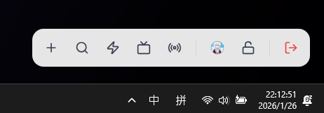
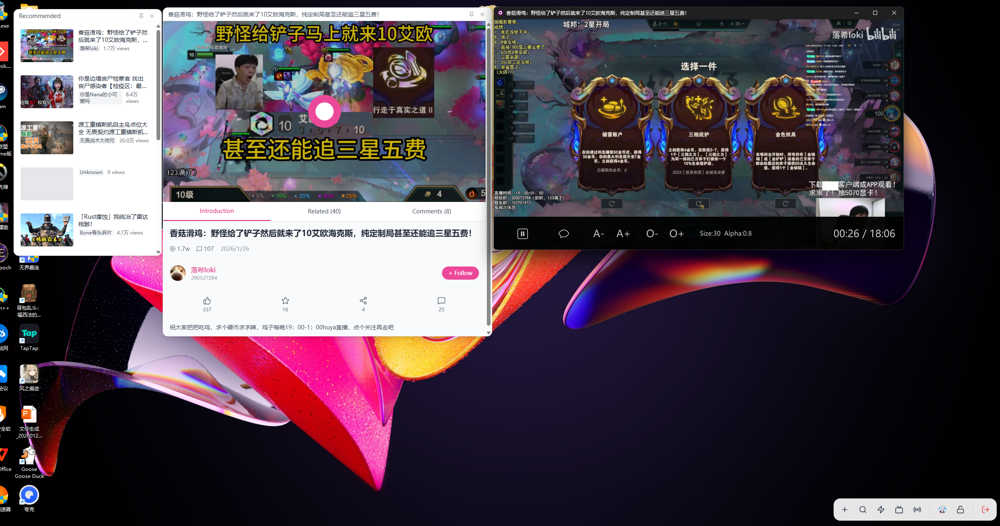

# BiliCard - Desktop Bilibili Widget


BiliCard 是一个基于 Electron + React 的 Bilibili 桌面挂件应用，旨在提供轻量级、无干扰的 Bilibili 浏览体验。

它采用独特的“便签小组件”设计，支持桌面吸附、悬浮窗播放、直播弹幕等功能。

- ✨ 常驻桌面的小菜单

- ✨ 视频搜索与播放

- ✨ 直播搜索与播放


## ✨ 特性

- **卡片式交互**：Feed 流、搜索、直播、视频详情均以卡片形式展示，可自由拖拽、排列。
- **无缝播放**：
  - 集成 **MPV** 播放器，支持高性能视频解码。
  - 点击视频卡片直接调用 MPV 播放，支持无边框、置顶模式。
  - 详情页内嵌 MPV 控制，支持自动播放、相关视频跳转。
- **直播增强**：
  - 支持观看直播（调用 MPV）。
  - **实时弹幕**：通过 WebSocket 连接 B 站直播间，支持弹幕悬浮显示。
- **沉浸式体验**：
  - 支持登录（扫码登录），同步推荐流。
  - 评论区浏览、点赞、收藏等基础互动。
  - 极简 UI 设计，专注于内容消费。


## 📅 更新日志

- **v0.1.0** (2026-01-26)
  - 初始版本，实现基础功能（Feed 流、视频播放、直播播放、弹幕）。
  - 支持登录（扫码登录），同步推荐流。
  - 自定义的MPV 播放器，以支持视频播放、直播播放、弹幕。
  - 极简 UI 设计，专注于内容消费。

- **v0.2.0** (2026-01-28)
  - 为了遵循原生，轻量的宗旨。播放器改为使用WEB Play，通过CSS注入的方式裁剪网页，只显示播放容器至卡片中，减少巨量的包体大小
  - 使右下角的dock栏常驻桌面最上层并且可拖动，点击“🔒”按键可以禁用拖动，若卡片被其他页面遮挡，点击dock可以重新显示
  - 新增了设置页面，点击“⚙️”按键可以打开设置页面，目前仅占位，无实际作用
  - 拓展了环绕个人登陆的收藏，稍后再看，追番，观看历史功能，点击dock栏的+号，以展开dock栏查看新增功能
  - 修复了部分登陆状态的全局性，修复了部分视频因bilicard网络层过于严谨导致的被cdn拒绝视频推流的问题。现在可以正常观看所有普通视频了，直播webplay仍在测试状态，存在无登陆状态的问题
  - 为直播页面单独实现了弹幕发送框，防止复杂的live.bilibili页面影响画面
  - 视频相关卡片可以最大化了


## 🛠️ 技术栈

- **Core**: Electron, React 19, TypeScript, Vite
- **State Management**: Zustand
- **UI/Styling**: TailwindCSS, Lucide React
- **Video Player**: MPV (libmpv / mpv.exe), IPC Control
- **Networking**: Fetch API, WBI Signature (Bilibili API)

## 🚀 开发指南

### 前置要求

- Node.js (v18+)
- npm / yarn / pnpm

### 安装依赖

```bash
cd DesktopCanvas
npm install
```

### 启动开发环境

```bash
npm run dev
```

### 打包构建

```bash
npm run dist
```

构建产物将位于 `DesktopCanvas/release` 目录下。

## 📂 目录结构

```
DesktopCanvas\
├── electron/             # Electron 主进程代码
│   ├── main.ts           # 应用入口、窗口创建、IPC 通信、网络拦截
│   └── preload.ts        # 预加载脚本，暴露 Node.js API 给渲染进程
├── src/                  # React 渲染进程代码
│   ├── components/       # UI 组件
│   │   ├── canvas/       # 画布组件
│   │   └── cards/        # 各类业务卡片组件 (feed, detail, live, etc.)
│   ├── services/         # 业务逻辑服务
│   │   └── bili-service.ts # Bilibili API 封装 (Axios + WBI 签名)
│   ├── store/            # Zustand 状态管理
│   │   ├── useCanvasStore.ts # 画布位移、缩放状态
│   │   ├── useCardStore.ts   # 卡片增删改查状态
│   │   └── useUserStore.ts   # 用户登录信息状态
│   └── utils/            # 工具函数 (IPC 鼠标穿透控制、WBI 签名算法)
└── ...
```

## 📝 License

MIT

---

**注意**：本项目仅供学习交流使用，请勿用于商业用途。Bilibili 相关数据版权归 Bilibili 所有。
